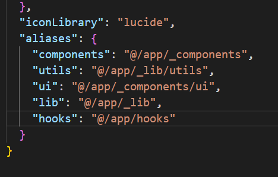
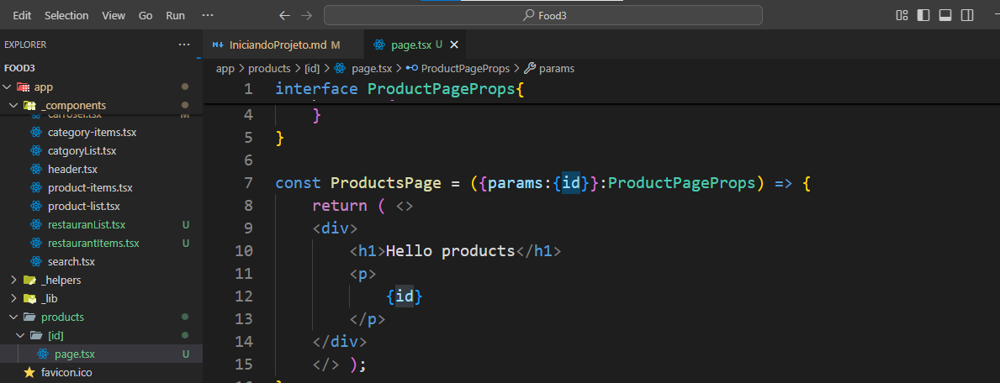

# 1 npx create-next-app@latest
    [x] typesCript /Sim
    [x] Eslint
    [x] tailwindcss /Sim
    [x] src/Directory / no
    [x] appRouter / sim
    [x] O restante e não
# 2 Usa  o prisma com o next 
[x] - npm i prisma --save-dev
# 3 para dizer qual banco eu vou usar como ORM
    #Lembrando que a  ultima escrita é para dizer qual banco 
[x] -  npx prisma init --datasource-provider postgresql

#  4 Logo em Seguida eu Faço eu faço meu banco de dado no Schema 
[x] - Para fazer um Schema preciso do model e o Nome.
    model Restaurant {
  //  pk @id [e o default vai ser aleatorio]
  id           String     @id @default(uuid())
  name         String
  imageUrl    String
  //  esse db.decimal é par apadronizer e dizer que antes da casa eu vou ter 10 depois vou ter 2
  deliveryFree Decimal    @db.Decimal(10, 2)
  deliveryTime Int
  categories   Category[]
  products     Product[]
}
## Para format o prisma
[x] - npx prisma format
# Temos o convenctional commit Boas praticas par aquem quera

# Logo em seguida eu fui no NeonDb para substituir o docker e criei um sistema para mim

## 5 Vou usar o neon para fazer a migration 
[x] - https://console.neon.tech/app/projects

##  6 Eu quero criar a migration ou Criar a tabela no meu Banco de dado
[x] - npx prisma migrate dev --name init_database

###  peg o seed e cria dentro da pasta prisma com seed.ts
# 7 NO PACKJSON EU ADICIONO ESSA AQUI 
     "prisma": {
    "seed": "ts-node ./prisma/seed.ts"
  }

# 8 Para popular meu Banco de dados 
vamos usar o seed.ts mas tem que instalar o ts-node facilita nossa vida.
[x] - npm i -D ts-node  // para instalar o ts-node

# 9 E por Fim [x] -  depois vamos  popular nosso db
 [x] - npx prisma db seed
--------------------------------------------------------------------------
# Vamos Usar componentes prontos. usando o shadcn.

# depois eu dou um comando.
[x] - npx shadcn@latest init 
    [x] Style Default
    [x] color Slate
    [x] Css variabel - sim

#todas a pasta do shadcn ele  -e bom colocar um _component para indentificar e fica facil par aa busca
# So instalando um components card
[x] - https://ui.shadcn.com/docs/components/card
# configurando o shadcn
 ## Depois vou configurar no components.json

as rotas onde fica para colocar dentro do app..

# Ai faço uma instalação do component foi um card
[x] - npx shadcn@latest add card

# e depois um Buton
[x] - npx shadcn@latest add button

depois eu acabei fazendo algo mais complicado.
# instalei o prettier
npm install -D prettier prettier-plugin-tailwindcss
# crio um apasta .prettierrc.
# colo esse codigo 
{
  "plugins": ["prettier-plugin-tailwindcss"]
}
e o eslint e para me mostrar erro de algo que  esta criada e não esta sendo usada

# 10 Error caso tenha um erro com o Tailwind aconsleho retroceder ele par ao 3
[x] -  npm install -D tailwindcss@3
# 10.1 E depois inicializalos 
[x] - npx tailwindcss init
[x] - fiz a configuração e voltei para o v4
----import type { Config } from "tailwindcss"

const config = {
  darkMode: ["class"],
  content: [
    './pages/**/*.{ts,tsx}',
    './components/**/*.{ts,tsx}',
    './app/**/*.{ts,tsx}',
    './src/**/*.{ts,tsx}',
	],
  prefix: "",
  theme: {
    container: {
      center: true,
      padding: "2rem",
      screens: {
        "2xl": "1400px",
      },
    },
    extend: {
      colors: {
        border: "hsl(var(--border))",
        input: "hsl(var(--input))",
        ring: "hsl(var(--ring))",
        background: "hsl(var(--background))",
        foreground: "hsl(var(--foreground))",
        primary: {
          DEFAULT: "hsl(var(--primary))",
          foreground: "hsl(var(--primary-foreground))",
        },
        secondary: {
          DEFAULT: "hsl(var(--secondary))",
          foreground: "hsl(var(--secondary-foreground))",
        },
        destructive: {
          DEFAULT: "hsl(var(--destructive))",
          foreground: "hsl(var(--destructive-foreground))",
        },
        muted: {
          DEFAULT: "hsl(var(--muted))",
          foreground: "hsl(var(--muted-foreground))",
        },
        accent: {
          DEFAULT: "hsl(var(--accent))",
          foreground: "hsl(var(--accent-foreground))",
        },
        popover: {
          DEFAULT: "hsl(var(--popover))",
          foreground: "hsl(var(--popover-foreground))",
        },
        card: {
          DEFAULT: "hsl(var(--card))",
          foreground: "hsl(var(--card-foreground))",
        },
      },
      borderRadius: {
        lg: "var(--radius)",
        md: "calc(var(--radius) - 2px)",
        sm: "calc(var(--radius) - 4px)",
      },
      keyframes: {
        "accordion-down": {
          from: { height: "0" },
          to: { height: "var(--radix-accordion-content-height)" },
        },
        "accordion-up": {
          from: { height: "var(--radix-accordion-content-height)" },
          to: { height: "0" },
        },
      },
      animation: {
        "accordion-down": "accordion-down 0.2s ease-out",
        "accordion-up": "accordion-up 0.2s ease-out",
      },
    },
  },
  plugins: [require("tailwindcss-animate")],
} 

export default config -----

para que  o di funcione eu preciso colocar um pagina com o [id] e dentro desssa pagina te ro page.tsx quando eu for pesquisar ele vai me retorna o numero do id 

## Fiz um componente unico onde eu tenho que usar o router para  que ele pegue tive que criar um folder _component para redenrizar uma image junto com o botão porem o botão vai precisar usar o router por isso ele esta separado.

logo em seguida no componente principal fiz um desconto so para usar ele  em todos os lugares.